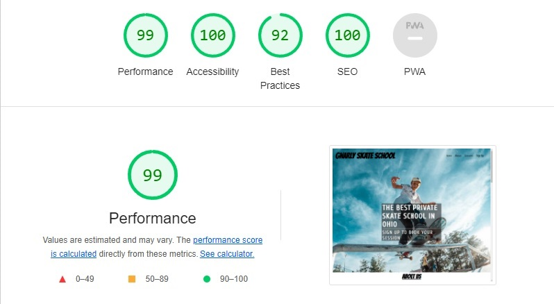

# **Gnarly Skate School**

The Gnarly Skate School webiste are a website where parents can read about us and sign up, to have their kids learn skateboaring in all its forms. We teach kids from age 8-15 and of all skill levels. We offer a safe environment, progress and a lot of fun! 

This website is a one-page website with 4 differents sections. On this website, you as a user will be able to find a beautiful header with navigation, information about the school, the type of lessons we provide, pictures and a sign up form.

## **Features**
---
### **Navigation** 

On the top of the site, you have the navigation bar. The logo or "headline" to the left and navigation options to the right. The following options are:
- Home button (When clicked, takes you to the top of the site)
- About Us button (When clicked, takes you to the About section of the site)
- Lessons button (When clicked, takes you to the Lessons section of the site)
- Sign Up button (When clicked, takes you to the Sign Up section of the site)

### **Hero-text**
On the header, there is a hero-text wich zooms in when the site is finished loading. The hero text is clear and tells the user exactly what this site is about.

### **Header**

For the header, I chose to have kind of a hero image and put my content ontop of it. The header consists of:
- Navigation bar
- Hero text for the website
- Hero Image

It is very clear to the user what and who the site is for and easy to navigate to different sections.

### **The About Us section**

On the About Us section, you can find all the information you need about who Gnarly Skate School is and what they stand for and how you can book a session.

### **The Lessons section**

Here you can find all the information about the different lessons that are offered. At the time of writing this, there are two lessons available:
- Street lessons (skating on street ramps, down stairs, rails etc)
- Vert lessons (skating on a big ramp)

### **The Sign Up section**

This is the part of the website where you as a user can sign up for to our roster and we will contact you for booking of lessons. The section consists of:
- A background image 
- A Sign Up form (where you need to fill out all the fields correctly to proceed)

### **Footer**
The footer is at the bottom of the page and shows social media links that will take you to different sites on a new tab. The icons used are from (https://fontawesome.com):
- Facebook
- Instagram
- Twitter
- Youtube

## **Bugs & Fixes**

I encountered a bug where my background images for the header and the signup page, did not show on the deployed link through Github. I fixed it by changing the directory of the background images. instead of having background-image: `url('/assets/images/hero-image.jpg')` in css I removed the "/" and added "../" for it to work. So it looked like this:
`url('../assets/images/hero-image.jpg')`

## **Testing**
### **HTML**
- I tested my html code on [W3C HTML validator](https://validator.w3.org/#validate_by_input) and found no errors.
### **CSS**
- I tested my css code on [W3C css validator](https://jigsaw.w3.org/css-validator/) and found no errors.
### **Accessibility**
- I made sure that the colors I used are easy to read and go well together. and I tested it on lighthouse in devtools.

- I have confirmed that this site is responsive, by using css grid layout and media queries to size it to different resolutions.
- I have deployed my site to Github pages, and made sure it works on Chrome, Safari and Firefox.
- The form works as it's supposed to. I have borrowed Code Institutes [link](https://formdump.codeinstitute.net/) for forms and you can't sign up unless you fill out all the required fields.

## **Unfixed Bugs**

There are no unfixed bugs.

## **Deployment**
The site is deployed to GitHub pages and to deploy it you need to do the following:
- Go to your repositories and click on the one you want to deploy
- Click the settings option
- Choose "Pages" in the menu to the left
- Choose "Deploy from a branch" and when choosing branch, choose the branch named "main"
- Lastly, click the "save" button

You can find the live link to my site [here](https://fullstacksammy.github.io/gnarly-skate-school/).

## **Credits**

### **Content**
- The content used for animations of the hero-text was taken from CI [Love Running](https://github.com/Code-Institute-Org/love-running-2.0) project.

### **Images**
- The free use images used in this project were all taken from [Unsplash](https://unsplash.com/).

